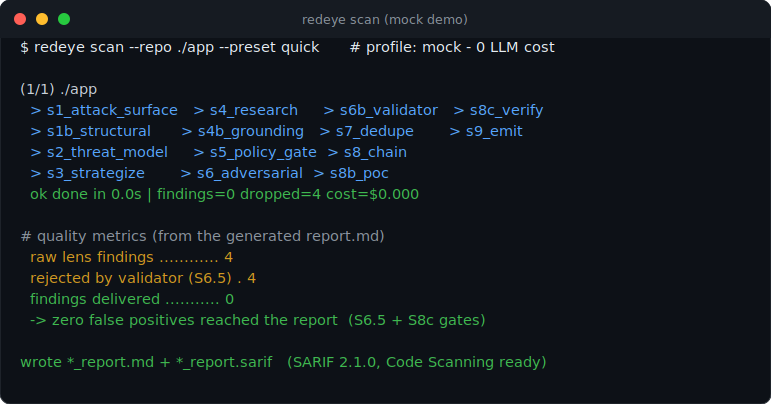

# RedEye

[](LICENSE)
[](pyproject.toml)
[](docs/architecture.md)

`redeye` is an open-source agentic SAST harness for autonomous vulnerability discovery using frontier AI models. It pairs the deep multi-stage pipeline of an offline research harness with the operational layer of a CI/CD scanner — so the same tool runs as a researcher's deep-dive on Monday and as a PR gate on Tuesday.

Three design choices drive finding quality:

1. **Threat modeling before analysis** — focuses the attack surface so research lenses don't waste budget on low-impact areas.
2. **Multi-agent voting + a single-pass validator** — N-of-M voting kills correlated false positives; a cheap precision-filter validator drops the obvious garbage.
3. **Feedback loop** — reviewer TP / FP marks from PR comments persist to a local SQLite store and are fed back into the next scan as in-context calibration.

Multi-cloud LLM by design: Anthropic (CLI / SDK), OpenAI / OpenAI-compatible, **AWS Bedrock**, **Google Vertex (Gemini)**, **Ollama (local)**. No single provider is a dependency.

> **New — Claude Fable 5 support.** A bundled `fable` profile routes the heavy research and adversarial stages through Anthropic's `claude-fable-5` (cheap survey/report/validation stages stay Haiku-class) for maximum recall while the deterministic precision layers carry the false-positive burden. Run it with `redeye scan --profile fable`, or set `REDEYE_PREFER_QUALITY=1` to auto-upgrade the `auto` profile's SDK model. `claude-opus-4-8` is also selectable per-role in any `sdk` profile.

> **Authorized use only.** Run scans only against code you own or have explicit permission to test. Findings are LLM-generated triage candidates that require human review — see [Limitations](#limitations).

**Docs:** [`SETUP_GUIDE.md`](docs/SETUP_GUIDE.md) · [`USER_GUIDE.md`](docs/USER_GUIDE.md) · [`architecture.md`](docs/architecture.md) · [`SKILLS.md`](docs/SKILLS.md) · [`configuration.md`](docs/configuration.md).

---

## Why use this?

**The problem it solves.** AI-generated SAST is noisy — models invent file
paths, hallucinate sinks, and bury reviewers in false positives. RedEye puts
seven deterministic checks (structural pre-index, taint schema, grounding pass,
validator auto-reject, PoC gate, multi-agent voting, outcome verification)
*in front of* every
finding, so what reaches you cites real code and survived every cheap check the
harness can run.

**60-second quickstart.** No API keys, deterministic mock backend — full steps
in [Quickstart](#quickstart-60-seconds-zero-llm-cost) just below:
```bash
git clone git@github.com:sam00/AI-RedEye-harness.git redeye && cd redeye
make install && make demo      # writes ./out/*.md + *.sarif, zero LLM cost
```

**Example output.** Findings emit Markdown **and** SARIF 2.1.0 with
`security-severity` and taint `codeFlows`, so they render natively in GitHub
Code Scanning:



```jsonc
// excerpt of *_report.sarif (GitHub renders this inline on the PR + Security tab)
{
  "ruleId": "redeye/sql-injection",
  "level": "error",
  "message": { "text": "Unsanitized request param flows into a SQL string." },
  "properties": { "security-severity": "8.8" },
  "locations": [{ "physicalLocation": {
    "artifactLocation": { "uri": "app/users.py" },
    "region": { "startLine": 42, "endLine": 42 }
  }}],
  "codeFlows": [ /* source -> sink taint path, shown as an inline trace */ ]
}
```

<!--
  High-conversion visual: capture the SARIF results in your repo's
  GitHub "Security -> Code scanning" tab, save it as docs/sarif-code-scanning.png,
  then uncomment the line below.

-->
> _Upload the generated `*_report.sarif` with the `github/codeql-action/upload-sarif` action (the bundled workflow does this) and findings appear in your repo's **Security -> Code scanning** tab with inline taint traces._

**Who it's for.** AppSec engineers and security researchers who want an AI
deep-dive on Monday and a PR gate on Tuesday — from the same tool.

**What it is *not*.** Not a deterministic linter and not a source of ground
truth. Findings are **LLM-generated triage candidates** that require human
review; run only against code you own or are authorized to test.

---

## Capabilities at a glance

- **Agentic multi-stage pipeline** — 14 stages spanning attack-surface mapping, threat modeling, multi-lens research, adversarial review, multi-agent voting, dedupe, exploit chaining, PoC, **outcome verification (S8c)**, and SARIF/Markdown emit.
- **Seven-layer hallucination control** — structural pre-index, taint-flow schema, grounding pass, validator auto-reject, PoC gate, multi-agent voting, and a deterministic **K-of-N outcome verifier** — with a per-finding evidence trail and `hallucination_metrics`.
- **Multi-cloud + offline backends** — Anthropic (SDK/CLI), OpenAI, AWS Bedrock, Google Vertex (Gemini), local Ollama, and a deterministic mock; auto-detected, no single provider required.
- **Dual-mode, preset-driven** — `--preset deep` for research, `--preset pr`/`ci` for gating, `--preset quick` for a zero-cost mock demo.
- **CI/CD + feedback loop** — diff-only PR scans, DoS scope caps, SARIF 2.1.0 with taint `codeFlows`, PR comments with TP/FP checkboxes, a SQLite feedback loop folded into the next scan, and webhooks.
- **Enterprise foundation** — multi-target batch intake (`--repo-file`) plus file-first CMDB / CVE-feed / control enrichment (asset criticality, CVE↔CWE correlation); _pipeline wiring in progress_.
- **Verifiable, shareable outputs** — Markdown, self-contained **HTML** (verified/corroborated filters, triage-first order, per-stage cost table), **PDF**, SARIF 2.1.0, and flat **`findings.json` / `findings.csv`**. Every finding shows its deterministic **verification verdict** (K-of-N signals) so "verified" is auditable, not asserted. Regenerate any format from a past run with **`redeye report`** — no rescan, $0.
- **Auditable by default** — every run writes `run_manifest.json`: tool version, profile, config hash, target SHA, and per-stage cost + quality metrics.

---

## Built on prior art

RedEye started from the open-source ideas in Visa's **[Vulnerability Agentic Harness (VVAH)](https://github.com/visa/visa-vulnerability-agentic-harness)** (Apache-2.0) and has since been substantially reworked and extended — the capabilities above are RedEye's own. Full upstream attribution is preserved in [`NOTICE`](NOTICE) and the [Attribution](#attribution) note at the end.

---

## Quickstart (60 seconds, zero LLM cost)

```bash
git clone git@github.com:sam00/AI-RedEye-harness.git redeye
cd redeye
make install           # python3 -m venv + pip install -e ".[dev]"
make demo              # mock-backend scan against ./, writes ./out/*.md + .sarif
```

That's it -- you have a working install and a complete sample report in
`./out/`. The mock backend is deterministic, needs no API keys, and exercises
all 14 pipeline stages.

When you're ready to run with a real LLM:

```bash
make init              # interactive wizard: detects creds, writes .env, recommends profile
make scan-pr           # diff-only PR scan with strict grounding
make scan-ci           # bounded full-repo CI scan
make scan-deep         # research mode (no DoS limits, keep weakly-grounded triage candidates)
```

Or use the CLI directly with the same shortcuts:

```bash
redeye init                                # interactive setup
redeye scan --repo . --preset pr           # PR scan
redeye scan --repo . --preset ci           # CI scan
redeye scan --repo . --preset deep         # deep research
redeye scan --repo . --preset quick        # mock demo
```

Each `--preset` is just a default-overlay for the standard scan flags --
**any explicit flag you pass on the command line still wins**. So
`redeye scan --preset pr --max-files 200` keeps the PR-preset's strict
grounding and exclusions but bumps the file cap to 200.

| Preset | Backend | Scope | Grounding | Use when |
|---|---|---|---|---|
| `quick` | mock (no LLM cost) | small | lenient | trying the tool, CI smoke tests |
| `pr` | active profile | files changed vs `origin/main` | strict | every PR (mirrors the bundled GHA workflow) |
| `ci` | active profile | whole repo, DoS-capped | strict | nightly cron / `workflow_dispatch` |
| `deep` | active profile | unlimited | lenient (keeps weak-evidence) | research deep-dive |

---

## What's new in 0.3 -- the hallucination-reduction layer

Seven new filters in front of the report, designed so a finding can't reach
the operator without surviving every cheap deterministic check the harness
knows how to run. See [`docs/REDUCING_HALLUCINATIONS.md`](docs/REDUCING_HALLUCINATIONS.md)
for the long-form rationale.

- **Structural pre-index (S1b, deterministic).** Regex/AST scan extracts
  the *real* routes / sources / sinks / secrets from the target before
  any LLM call. Lenses cite this inventory; they no longer get to invent
  paths.
- **Taint flow schema.** Every finding ships with explicit ``source``,
  ``sink``, ``sanitizer_missing``, and a step-by-step ``taint_path``.
  Hand-wavy findings without source + sink are dropped at parse time.
- **Grounding pass (S4b, deterministic).** Opens every cited file,
  verifies the line range, looks for CWE-family tokens in a +/-5 line
  window. Findings citing fictional code are tagged or (with
  ``--strict-grounding``) dropped.
- **Validator auto-reject (S6.5).** Skips the LLM call entirely for
  findings already tagged as hallucinated by S4b -- no point asking a
  model to confirm a bug that cites code which doesn't exist.
- **PoC gate (S8b).** Forces the model to write a concrete exploit
  payload -- syntactic checks reject placeholders. Findings without a
  real PoC get demoted by one severity notch (or dropped with
  ``--require-poc``).
- **Outcome verification (S8c, deterministic).** A final K-of-N verdict
  over five independent signals already gathered upstream (grounding,
  taint completeness, concrete PoC, reachability, voter/validator
  agreement). Temperature-free, so it suppresses false positives even on
  models that reject ``temperature`` (Opus / ``cli``) where voting is a
  no-op. Unverified findings are flagged, or dropped when its ``strict``
  param is set.
- **Quality metrics in the manifest and report.** Counters for
  ``raw_lens``, ``ungrounded_dropped``, ``ungrounded_downgraded``,
  ``validator_rejected``, ``voted_out``, ``missing_poc``, ``outcome_unverified``. Operators see
  exactly how much noise the harness pruned before they read anything.
- **Per-finding evidence list.** Every survivor carries a list of
  ``[PASS]`` / ``[FAIL]`` rows showing which checks it passed. The
  Markdown report renders this so reviewers can audit the harness's
  reasoning.
- **CodeFlows in SARIF.** When a taint path is present, SARIF emits it
  as a proper ``codeFlows`` / ``threadFlows`` block. GitHub Code
  Scanning renders this as an inline taint trace.

CLI additions:

```bash
redeye scan --repo .  --strict-grounding         # drop findings with bad paths
redeye scan --repo .  --require-poc              # drop findings without a runnable PoC
```

## What's new -- verified, shareable outputs

The deterministic S8c verification verdict is now **surfaced in every report**,
not just computed internally -- so "validated & verified" is auditable per
finding. Plus new ways to share and regenerate results without spending budget:

- **Verification in every format.** Markdown (per-finding block + report-level
  *Verification summary*), HTML (verdict badge + signal chips), PDF, and SARIF
  (`properties.verification`) all show the K-of-N verdict and which independent
  signals passed (grounding, taint, PoC, reachability, voting, external
  corroboration).
- **Richer, triage-first HTML report.** Full parity with Markdown (taint, PoC,
  evidence trail, votes, CVSS), plus **Verified** / **Corroborated** filters,
  verified+corroborated findings sorted first, and a per-stage cost/timing
  table. Still a single self-contained file, zero external assets.
- **`redeye report <manifest>`.** Regenerate any output
  (`--format html|pdf|md|json|csv|all`) from an existing `run_manifest.json`
  with **no rescan** ($0, offline). `--open` launches the HTML in a browser.
- **Flat `findings.json` / `findings.csv`.** One row per finding (severity,
  CWE, CVSS, confidence, verified/corroborated flags, location, remediation)
  for dashboards, ticketing, and run-to-run diffs. Emitted by every scan.
- **Opt-in LLM response cache** (`--cache` / `REDEYE_LLM_CACHE`). Caches
  *deterministic* (temperature 0/None) completions on disk and reuses them on
  re-runs; stochastic sampling (voting/self-consistency) is never cached, so
  detection diversity is preserved. Cache hits report `$0` new spend.
- **Eval gate in CI.** The bundled `ci` workflow runs `redeye eval` against the
  labeled benchmark (uploading precision/recall/hallucination metrics) and
  exercises `redeye report` in the smoke job.

```bash
redeye scan --repo . --cache                     # reuse deterministic LLM calls on re-runs
redeye report --manifest ./out/run_manifest.json --format all --open
redeye eval --profile mock --min-precision 0.8 --max-hallucination 0.1   # CI gate
```

## Highlights -- the operational layer

Operational layer (CI/CD + feedback):

- **PR-scan mode** — `--diff-only --pr-base origin/main` only scans files changed in a PR.
- **DoS limits** — `--max-files`, `--max-file-bytes`, `--max-total-bytes`.
- **Path exclusion** — `--exclude-path` (repeatable).
- **Custom prompts** — `--custom-prompt-file` appended to every system prompt; useful for "focus on payment paths" or "ignore CWE-200 in /admin".
- **Validator stage (S6.5)** — single-pass TP/FP gate, distinct from voting; cheap on Haiku / Gemini Flash.
- **PR comment writer** — `--pr-comment ./out/comment.md` produces a Markdown comment with `[ ] True Positive` / `[ ] False Positive` checkboxes.
- **Feedback loop** — `--store-findings` persists to SQLite (`~/.redeye/scans.db`); `--use-feedback` injects prior TP / FP marks into the next scan's lens prompts.
- **`collect-feedback` subcommand** — parses a PR comment, writes verdicts to the store. Triggered by the `issue_comment.edited` GHA event.
- **Webhooks** — `--webhook-url` + `--webhook-type slack|teams|discord|generic` with optional HMAC signing via `REDEYE_WEBHOOK_SECRET`.
- **GitHub Actions workflow** — PR scan + full scan + feedback collection in one drop-in YAML at `.github/workflows/redeye-scan.yml`.
- **CVSS** — every finding can carry a `cvss_vector` and `cvss_score`; SARIF emits both, plus `security-severity` for GitHub Code Scanning.
- **New backends** — `bedrock` (AWS Claude), `vertex` (Gemini), `ollama` (local).
- **Latest Anthropic models** — bundled `fable` profile using `claude-fable-5`, and `claude-opus-4-8` selectable per-role on the `sdk` backend (both priced in the cost table).
- **Labeled-benchmark evaluation** — `redeye eval` scores a scan against ground truth (precision / recall / F1 / hallucination rate) with CI gates (`--min-precision`, `--min-recall`, `--max-hallucination`), now wired into the `ci` workflow.
- **HTML + PDF + flat exports** — besides Markdown and SARIF, findings emit as a self-contained interactive HTML report (verified/corroborated filters, triage-first order, per-stage cost table), a PDF for non-CLI stakeholders, and flat `findings.json` / `findings.csv`.
- **`redeye report`** — regenerate any report format from an existing `run_manifest.json` with no rescan ($0); `--open` launches the HTML.
- **Verification surfaced everywhere** — the deterministic S8c K-of-N verdict and its signals are rendered in Markdown/HTML/PDF and included in SARIF `properties.verification`.
- **Opt-in LLM cache** — `--cache` (or `REDEYE_LLM_CACHE`) reuses deterministic completions across re-runs; stochastic sampling is never cached.

Agentic pipeline (from the 0.1 / 0.2 base):

- 3 phases / 9 stages (now 10 with optional validator).
- Multi-agent voting for FP suppression at S6.
- Per-stage budget caps.
- Skill-based extensibility.
- AGENTS.md / CLAUDE.md operating files.
- SARIF 2.1.0 + Markdown + run manifest.
- Multi-target batch scan.

Roadmap (not yet implemented; PRs welcome):

- Jira historical-context loader (pull prior vuln tickets for a service into the prompt).
- Databricks feedback backend (alternative to local SQLite).
- Update-same-comment behavior for multi-commit PRs.
- Vector / SIEM log aggregation.

---

## Pipeline

Three phases, ten stages (S6.5 is opt-in).

| Phase | Stages | Purpose |
|---|---|---|
| Discovery & Modeling | S1 – S3 | Attack surface mapping, threat modeling, hunting plan |
| Deep Dive & Verification | S4 – S6 (+ S6.5) | Multi-lens research, policy gate, adversarial review, multi-agent voting, optional validator |
| Synthesis, Chaining & Reporting | S7 – S9 | Deduplication, chain construction, SARIF emission |

See [`docs/architecture.md`](docs/architecture.md) for stage-by-stage detail.

---

## Skills

| Stage | Skill |
|---|---|
| S1 | Attack-surface mapper |
| S2 | AppSec threat modeler (STRIDE) |
| S3 | Vulnerability research strategist |
| S4 | Language / Crypto / Logic / Access-control / IaC research lenses |
| S6 | Adversarial reviewer |
| S6.5 | Single-pass validator (optional) |
| S8 | Exploit strategist |

See [`docs/SKILLS.md`](docs/SKILLS.md).

---

## Requirements

- **Python ≥ 3.10**
- An LLM credential — pick one:
  - Claude Code login (`claude login`) for the default `cli` profile
  - `ANTHROPIC_SDK_API_KEY` for `via: sdk`
  - `OPENAI_API_KEY` for `via: openai`
  - AWS creds + `bedrock` extra for `via: bedrock`
  - GCP creds + `vertex` extra for `via: vertex`
  - A running Ollama server for `via: ollama`
  - **Nothing** for `via: mock` — fully offline, deterministic, perfect for CI smoke tests.

## Install

```bash
python3 -m venv .venv && . .venv/bin/activate
pip install .                  # core
pip install ".[bedrock]"       # + AWS
pip install ".[vertex]"        # + GCP
pip install ".[all]"           # all optional backends
```

The package installs two console scripts: `redeye` (long form) and `redeye` (short alias).

## Configure

```bash
cp .env.example .env
```

Edit `.env` and fill in only what your active profile needs. The harness loads `.env` automatically by walking up parent directories from the working directory; shell-exported variables take precedence.

See [`docs/configuration.md`](docs/configuration.md) for the full env-var matrix and profile syntax.

## Run

```bash
# Health check
redeye doctor

# Scope and cost preview (no LLM calls)
redeye estimate --repo /path/to/target

# Full scan
redeye scan --repo /path/to/target --application-id 12345

# PR scan (only files changed vs origin/main)
redeye scan --repo . --diff-only --pr-base origin/main \
         --max-files 100 --max-file-bytes 500000 --max-total-bytes 5242880 \
         --exclude-path test --exclude-path vendor \
         --pr-comment ./out/comment.md \
         --store-findings --use-feedback

# Notify Slack on completion
redeye scan --repo . --webhook-url "$SLACK_URL" --webhook-type slack

# Ingest reviewer marks from a PR comment
echo "$COMMENT_BODY" | redeye collect-feedback

# Score against a labeled benchmark (CI gate on quality)
redeye eval --profile fable --min-precision 0.8 --min-recall 0.5
```

## GitHub Actions

Drop the prebuilt workflow into your repo:

```bash
mkdir -p .github/workflows
cp /path/to/redeye/.github/workflows/redeye-scan.yml .github/workflows/
```

It runs:

- **PR scan** on every pull request — diff-only, posts a Markdown comment with TP/FP checkboxes, uploads SARIF as an artifact.
- **Full scan** on `workflow_dispatch` — manual button in the Actions UI.
- **collect-feedback** on `issue_comment.edited` — when a reviewer ticks a TP/FP box, the verdict is persisted.

Configure repo Secrets / Variables: `ANTHROPIC_SDK_API_KEY`, `OPENAI_API_KEY`, `AWS_*`, `GOOGLE_CREDENTIALS`, `REDEYE_WEBHOOK_URL`, `REDEYE_PROFILE` (variable).

## Output

Per target, under `<output_dir>`:

- `<module>_<ts>_report.md` — Markdown report
- `<module>_<ts>_report.sarif` — SARIF 2.1.0
- `<module>_<ts>_report.html` — self-contained interactive HTML report (only with `--html`; filter by severity/CWE/grounded)
- `<module>_<ts>_report.pdf` — styled PDF report (only with `--pdf`; needs `reportlab`)
- `pr-comment.md` — (only with `--pr-comment`) Markdown shaped for `gh pr comment`
- `run_manifest.json` + `run_manifest_<ts>.json` — audit record (tool version, profile, config hash, target SHA, per-stage costs)

## Limitations

- **LLM-generated, non-deterministic.** Findings are triage candidates, not confirmed vulns. Two runs can differ.
- **Token-hungry.** Caps are per-stage. Use `redeye estimate` and the DoS limits.
- **Elevated privilege.** Run only against trusted repositories by authorized operators.
- **Feedback loop is local-first.** SQLite at `~/.redeye/scans.db` (configurable via `REDEYE_DB_PATH`). Databricks backend is on the roadmap.

See `docs/` for the full reference.

---

## Security

See [`SECURITY.md`](SECURITY.md). Don't open security issues in a public tracker.

## License

Apache-2.0. See [`LICENSE`](LICENSE) and [`NOTICE`](NOTICE).

### Attribution

RedEye is a **derivative work of the [Visa Vulnerability Agentic Harness (VVAH)](https://github.com/visa/visa-vulnerability-agentic-harness)**, Copyright 2026 Visa, Inc., used under the Apache License, Version 2.0. RedEye's architecture, scaffolding, and documentation derive from VVAH; the source code has been substantially reworked and extended. Per Apache-2.0 §4, the upstream copyright and attribution are retained in [`NOTICE`](NOTICE).
